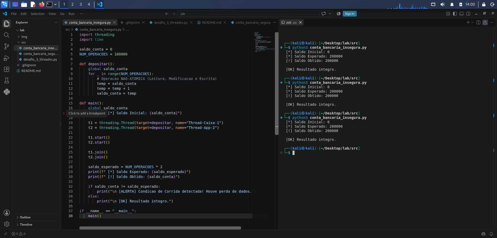
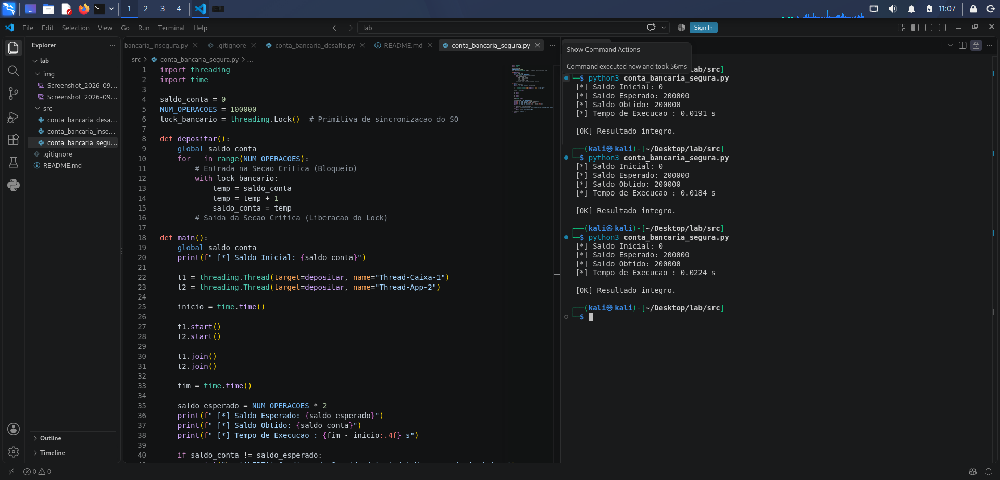
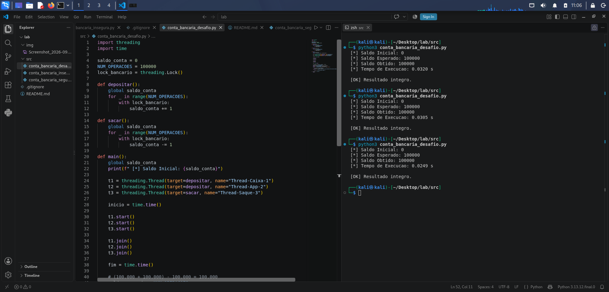

# Laboratório 01: Concorrência, Threads e Race Condition

**Disciplina:** Sistemas Operacionais (2026.2)  
**Instituição:** UNIFADESA - Análise e Desenvolvimento de Sistemas (ADS)  
**Docente:** Prof. Esp. Rodrigo Martins Sousa  
**Aluno(s):** Melquesedeque Ximenes Reis Moraes 

---

## 1. Visão Geral da Prática
Este repositório contém a resolução do **Roteiro de Laboratório 01 (N1)**. O objetivo da prática é simular e compreender na prática o fenômeno de **Condição de Corrida (Race Condition)** no acesso concorrente a variáveis compartilhadas na memória, além de aplicar o mecanismo de **Exclusão Mútua** via primitivas de sincronização do Sistema Operacional (**Mutex / Lock**).

---

## 2. Condição de Corrida (`conta_bancaria_insegura.py`)

No primeiro script, duas threads (`Thread-Caixa-1` e `Thread-App-2`) tentam realizar 100.000 incrementos de R$ 1,00 cada na variável global `saldo_conta` sem nenhuma trava de sincronização.

### Evidências de Execução (3 Testes)
Realizamos 3 execuções consecutivas do script inseguro no terminal:

#### Execução 1
``` 
 [*] Saldo Inicial: 0
 [*] Saldo Esperado: 200000
 [!] Saldo Obtido: 200000

 [OK] Resultado integro.

```


#### Execução 2
```
 [*] Saldo Inicial: 0
 [*] Saldo Esperado: 200000
 [!] Saldo Obtido: 200000

 [OK] Resultado integro.

```


#### Execução 3
```
 [*] Saldo Inicial: 0
 [*] Saldo Esperado: 200000
 [!] Saldo Obtido: 200000

 [OK] Resultado integro.

```


---

## 3. Exclusão Mútua com Mutex (`conta_bancaria_segura.py`)

No segundo script, a Seção Crítica (leitura, alteração e escrita da variável global) foi protegida utilizando a primitiva de sincronização `threading.Lock()`.

### Evidência de Execução Com Proteção
```
 [*] Saldo Inicial: 0
 [*] Saldo Esperado: 200000
 [*] Saldo Obtido: 200000
 [*] Tempo de Execucao : 0.0195 s

 [OK] Resultado integro.

```


---

## 4. Análise Teórica e Resposta às Questões

### Questão 1: Troca de Contexto e Atomicidade
**Pergunta:** Explique por que a linha `temp = temp + 1` e a posterior atribuição não são executadas em um único ciclo de CPU, permitindo que a troca de contexto cause inconsistência.

**Resposta:**
A operação de incremento não é **atômica** no nível da CPU. No nível de instrução de máquina, o incremento exige 3 passos distintos:
1. **Leitura:** Buscar o valor atual da variável da memória RAM e carregar em um registrador da CPU.
2. **Modificação:** Somar 1 ao valor no registrador (operação na ULA).
3. **Escrita:** Escrever o valor atualizado do registrador de volta no endereço da memória RAM.

Como cada passo exige ciclos de clock separados, o escalonador de processos do Sistema Operacional pode interromper a thread (interrupção por preempção / troca de contexto) no meio dessa sequência. 

*Exemplo do problema:*
- A **Thread A** lê o saldo `10` e é pausada pelo SO antes de gravar.
- A **Thread B** assume, lê os mesmos `10`, soma 1 e grava `11` na memória.
- A **Thread A** retoma sua execução, usando o registrador antigo (`10`), soma 1 e grava `11` na memória.
- **Consequência:** Dois depósitos ocorreram, mas o saldo subiu apenas de 10 para 11, resultando em perda de atualização e corrupção de dados.

---

### Questão 2: Custo do Lock (Overhead)
**Pergunta:** Compare o tempo de execução entre as versões insegura e segura. Por que o Lock adiciona sobrecarga (overhead)?

**Resposta:**
A versão segura exige mais tempo para finalizar do que a versão insegura. Esse acréscimo de tempo é chamado de **overhead de sincronização** e ocorre pelos seguintes fatores:
1. **Chamadas de Sistema (System Calls):** A criação, solicitação (`acquire`) e liberação (`release`) de Locks exigem intervenção direta do kernel do Sistema Operacional.
2. **Mudança de Estado de Threads:** Quando uma thread tenta acessar uma Seção Crítica trancada, o SO precisa alterar seu estado de *Running* para *Blocked/Waiting* e colocá-la na fila de espera, consumindo processamento do SO.
3. **Serialização da Execução:** O Lock força a Seção Crítica a ser executada em fila indiana (sequencialmente), anulando o ganho do processamento paralelo nas etapas protegidas.

---

## 5. Desafio Extra (Bônus)

Criamos uma variação que simula 3 threads concorrentes:
- **Thread 1:** Depósitos de R$ 1,00 (100.000 ops)
- **Thread 2:** Depósitos de R$ 1,00 (100.000 ops)
- **Thread 3:** Saques de R$ 1,00 (100.000 ops)

**Saldo Esperado Final:** $(100.000 + 100.000) - 100.000 = 100.000$

### Código da Solução
```python
import threading

saldo_conta = 0
NUM_OPERACOES = 100000
lock_bancario = threading.Lock()

def depositar():
    global saldo_conta
    for _ in range(NUM_OPERACOES):
        with lock_bancario:
            saldo_conta += 1

def sacar():
    global saldo_conta
    for _ in range(NUM_OPERACOES):
        with lock_bancario:
            saldo_conta -= 1

def main():
    t1 = threading.Thread(target=depositar, name="Thread-Caixa-1")
    t2 = threading.Thread(target=depositar, name="Thread-App-2")
    t3 = threading.Thread(target=sacar, name="Thread-Saque-3")

    t1.start()
    t2.start()
    t3.start()

    t1.join()
    t2.join()
    t3.join()

    saldo_esperado = NUM_OPERACOES
    print(f"[*] Saldo Esperado: {saldo_esperado}")
    print(f"[*] Saldo Obtido: {saldo_conta}")

if __name__ == "__main__":
    main()
```

